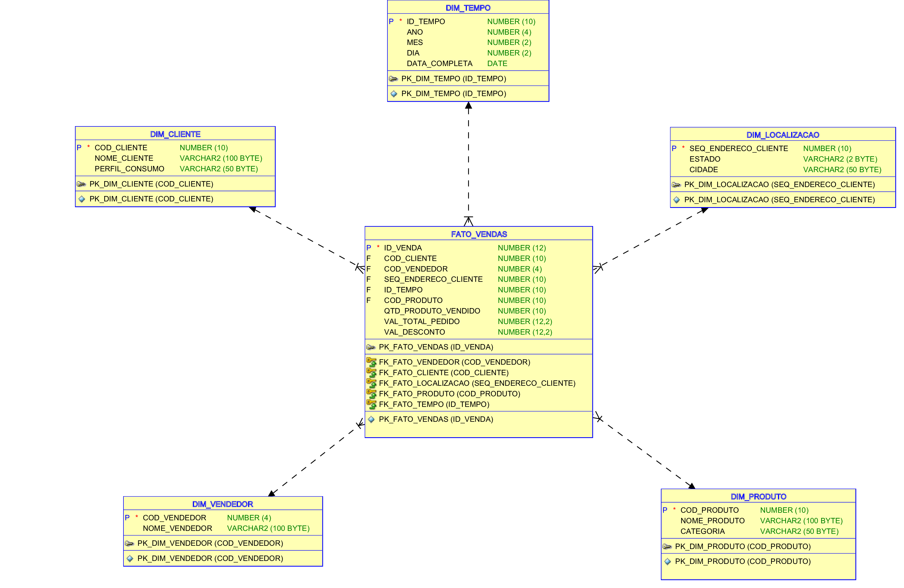

# Dicionário de Dados Completo - Modelo Estrela

Este documento detalha o Dicionário de Dados do Modelo Estrela, explicitando tabelas, colunas, descrições e relações.

---

## 1. Tabela Fato

### FATO_VENDAS
Registra os dados das vendas efetuadas, relacionando-se com as dimensões definidas.

| Coluna                  | Tipo de Dado   | Descrição                                     | Restrição             |
|-------------------------|----------------|-----------------------------------------------|-----------------------|
| ID_VENDA                | NUMBER(12,0)   | Identificador único da venda                  | PK                    |
| COD_PEDIDO              | NUMBER(10,0)   | Código associado ao pedido                    | -                     |
| COD_CLIENTE             | NUMBER(10,0)   | Cliente relacionado à venda                   | FK DIM_CLIENTE        |
| COD_VENDEDOR            | NUMBER(4,0)    | Vendedor responsável pela venda               | FK DIM_VENDEDOR       |
| SEQ_ENDERECO_CLIENTE    | NUMBER(10,0)   | Endereço de entrega da venda                  | FK DIM_LOCALIZACAO    |
| ID_TEMPO                | NUMBER(10,0)   | Data da venda                                 | FK DIM_TEMPO          |
| COD_PRODUTO             | NUMBER(10,0)   | Produto vendido                               | FK DIM_PRODUTO        |
| QTD_PRODUTO_VENDIDO     | NUMBER(10,0)   | Quantidade vendida                            | -                     |
| VAL_TOTAL_PEDIDO        | NUMBER(12,2)   | Valor total do pedido                         | -                     |
| VAL_DESCONTO            | NUMBER(12,2)   | Valor do desconto aplicado                    | -                     |
| DAT_CRIACAO             | DATE           | Data e hora da criação do registro            | -                     |
| DAT_ATUALIZACAO         | DATE           | Data e hora da última atualização             | -                     |

---

## 2. Tabelas Dimensões

### DIM_TEMPO
Armazena informações detalhadas sobre datas.

| Coluna          | Tipo de Dado   | Descrição                       | Restrição |
|-----------------|----------------|---------------------------------|-----------|
| ID_TEMPO        | NUMBER(10,0)   | Identificador único da data     | PK        |
| ANO             | NUMBER(4,0)    | Ano                             | -         |
| MES             | NUMBER(2,0)    | Mês                             | -         |
| DIA             | NUMBER(2,0)    | Dia                             | -         |
| DATA_COMPLETA   | DATE           | Data completa                   | -         |

### DIM_CLIENTE
Contém dados cadastrais e perfil dos clientes.

| Coluna            | Tipo de Dado        | Descrição                  | Restrição |
|-------------------|---------------------|----------------------------|-----------|
| COD_CLIENTE       | NUMBER(10,0)        | Identificador do cliente   | PK        |
| NOME_CLIENTE      | VARCHAR2(100 BYTE)  | Nome completo do cliente   | -         |
| PERFIL_CONSUMO    | VARCHAR2(50 BYTE)   | Perfil de consumo          | -         |

### DIM_VENDEDOR
Contém informações sobre vendedores.

| Coluna            | Tipo de Dado        | Descrição                      | Restrição |
|-------------------|---------------------|--------------------------------|-----------|
| COD_VENDEDOR      | NUMBER(4,0)         | Identificador do vendedor      | PK        |
| NOME_VENDEDOR     | VARCHAR2(100 BYTE)  | Nome completo do vendedor      | -         |

### DIM_LOCALIZACAO
Dados geográficos para análise de vendas.

| Coluna                   | Tipo de Dado        | Descrição                   | Restrição |
|--------------------------|---------------------|-----------------------------|-----------|
| SEQ_ENDERECO_CLIENTE     | NUMBER(10,0)        | Identificador do endereço   | PK        |
| ESTADO                   | VARCHAR2(2 BYTE)    | Estado (UF)                 | -         |
| CIDADE                   | VARCHAR2(50 BYTE)   | Cidade                      | -         |

### DIM_PRODUTO
Detalha os produtos comercializados.

| Coluna            | Tipo de Dado        | Descrição                      | Restrição |
|-------------------|---------------------|--------------------------------|-----------|
| COD_PRODUTO       | NUMBER(10,0)        | Identificador do produto       | PK        |
| NOME_PRODUTO      | VARCHAR2(100 BYTE)  | Nome do produto                | -         |
| CATEGORIA         | VARCHAR2(50 BYTE)   | Categoria do produto           | -         |
| PRECO             | NUMBER(12,2)        | Preço unitário                 | -         |

---

## Relações

| Tabela Fato  | Chave Estrangeira            | Tabela Dimensão     | Chave Primária   |
|--------------|------------------------------|---------------------|------------------|
| FATO_VENDAS  | COD_CLIENTE                  | DIM_CLIENTE         | COD_CLIENTE      |
| FATO_VENDAS  | COD_VENDEDOR                 | DIM_VENDEDOR        | COD_VENDEDOR     |
| FATO_VENDAS  | SEQ_ENDERECO_CLIENTE         | DIM_LOCALIZACAO     | SEQ_ENDERECO_CLIENTE |
| FATO_VENDAS  | ID_TEMPO                     | DIM_TEMPO           | ID_TEMPO         |
| FATO_VENDAS  | COD_PRODUTO                  | DIM_PRODUTO         | COD_PRODUTO      |

---

## Considerações Finais
Este dicionário proporciona clareza sobre o modelo estrela utilizado, facilitando o desenvolvimento e entendimento dos processos de ETL e análise por meio do dashboard.